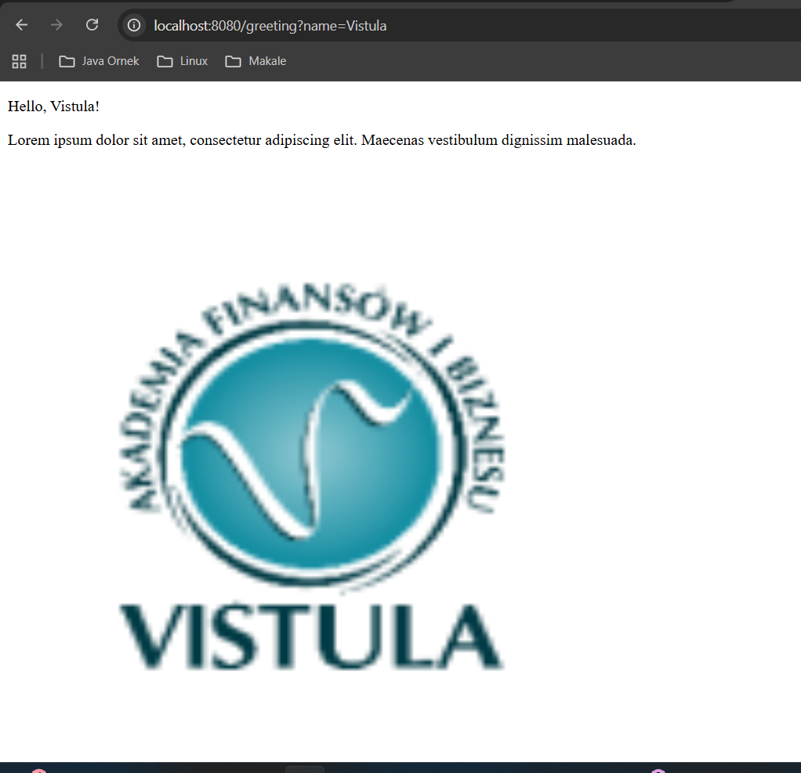

# First REST API Spring – Task 1

This project represents **Task 1** of the *First REST API Spring* course.
The main objective of this task is to initialize a Spring Boot application
and create a basic controller that handles an HTTP GET request and displays
content in a web browser.

---

## Features

- Spring Boot project initialized with Maven
- Simple Controller handling HTTP GET requests
- Greeting message generated using a request parameter
- Static content (text and image) displayed in the browser

---

## Application Output

**Requirement:**  
The application must correctly display a welcome message in a browser.

Example URL:# First REST API Spring – Task 1

This project represents **Task 1** of the *First REST API Spring* course.
The main objective of this task is to initialize a Spring Boot application
and create a basic controller that handles an HTTP GET request and displays
content in a web browser.

---

## Features

- Spring Boot project initialized with Maven
- Simple Controller handling HTTP GET requests
- Greeting message generated using a request parameter
- Static content (text and image) displayed in the browser

---

## Application Output

**Requirement:**  
The application must correctly display a welcome message in a browser.

Example URL:http://localhost:8080/greeting?name=Vistula

---

## Screenshot

---

## Technologies Used

- Java 17
- Spring Boot
- Spring Web
- Maven

---

## How to Run

1. Clone or download the project
2. Open the project in IntelliJ IDEA
3. Wait for Maven to download all dependencies
4. Run the main class:
5. Open a web browser and go to:http://localhost:8080/greeting?name=Vistula

---

## API Endpoint

| Method | Endpoint | Description |
|------|---------|------------|
| GET | /greeting | Returns a greeting message with provided name |

---

## Author

Student: Ayse Erdem  
Task: Task 1 – Spring Boot Project Setup & Basic Controller

